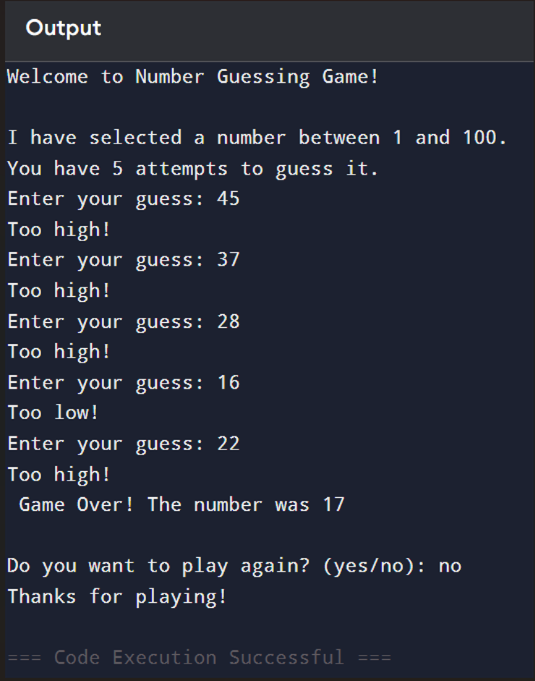

# Python Basics Toolkit

## About Project

This project contains beginner Python programs like a Simple Calculator, Number Guessing Game, and Password Generator. It is created to practice basic Python concepts like loops, conditions, and user input.
This is my first Python project showcasing basic program.

## 🚀 Features
* Simple Calculator
  - Performs addition, subtraction, multiplication and division
* Number Guessing Game
  - Guess a number between 1 and 100
  - Limited attempts
  - Hints (Too high / Too low)
  - Replay option
* Password Generator
  - Generate passwords with different options
  - Letters / Numbers / Special Characters
  - Replay option
  - Customizable password length
  
## 🛠 Tech Used
- Python

## ▶️ How to Run

1. Make sure Python is installed
2. Run any file:

For Calculator:
python calculator.py

For Number Guessing Game:
python number_guessing_game.py

For Password Generator:
python password_generator.py

## Output

### Calculator Output

### Number Guessing Game Output

### Password Generator Output

